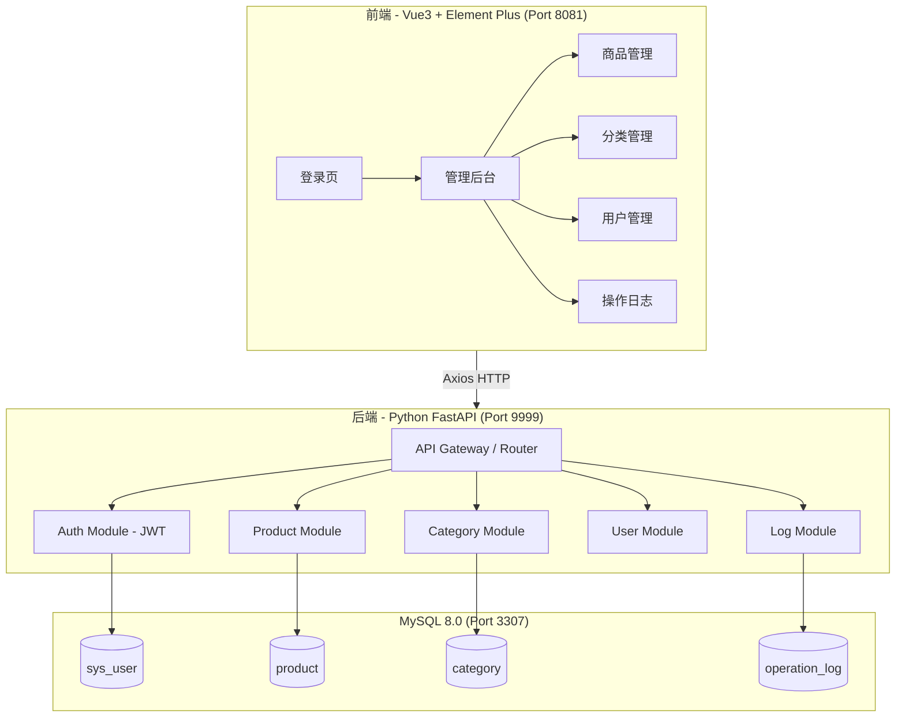
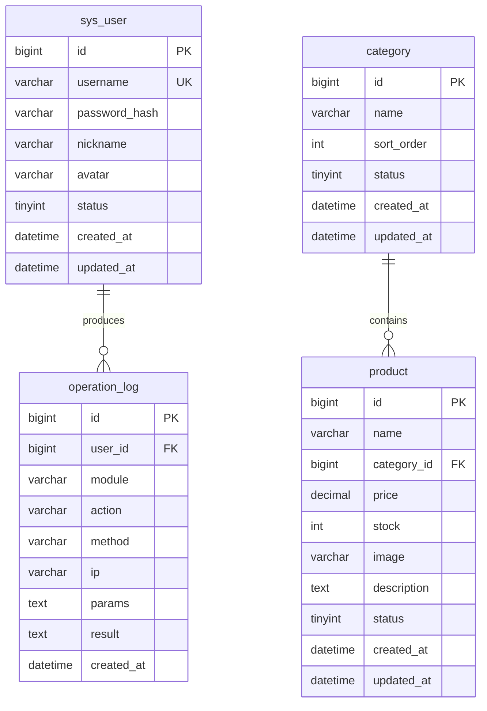

# 商品管理系统 - 项目设计文档

## 1. 系统架构

## 2. ER 图

## 3. 接口清单

### AuthController (`/api/auth`)
| Method | Path       | Description |
|--------|------------|-------------|
| POST   | /login     | 用户登录    |
| POST   | /logout    | 用户登出    |
| GET    | /profile   | 获取当前用户信息 |

### ProductController (`/api/products`)
| Method | Path       | Description |
|--------|------------|-------------|
| GET    | /          | 分页查询商品 |
| GET    | /{id}      | 商品详情    |
| POST   | /          | 新增商品    |
| PUT    | /{id}      | 修改商品    |
| DELETE | /{id}      | 删除商品    |

### CategoryController (`/api/categories`)
| Method | Path       | Description |
|--------|------------|-------------|
| GET    | /          | 查询分类列表 |
| GET    | /all       | 全部分类(下拉) |
| POST   | /          | 新增分类    |
| PUT    | /{id}      | 修改分类    |
| DELETE | /{id}      | 删除分类    |

### UserController (`/api/users`)
| Method | Path       | Description |
|--------|------------|-------------|
| GET    | /          | 分页查询用户 |
| POST   | /          | 新增用户    |
| PUT    | /{id}      | 修改用户    |
| DELETE | /{id}      | 删除用户    |

### LogController (`/api/logs`)
| Method | Path       | Description |
|--------|------------|-------------|
| GET    | /          | 分页查询日志 |

## 4. UI/UX 规范

| 属性       | 值                        |
|-----------|---------------------------|
| 主色调     | #409EFF (Element Plus 蓝)  |
| 成功色     | #67C23A                   |
| 警告色     | #E6A23C                   |
| 危险色     | #F56C6C                   |
| 背景色     | #F0F2F5                   |
| 卡片背景   | #FFFFFF                   |
| 卡片圆角   | 8px                       |
| 卡片阴影   | 0 2px 12px rgba(0,0,0,.08)|
| 字体       | -apple-system, "PingFang SC", "Helvetica Neue", sans-serif |
| 标题字号   | 18px / 16px / 14px        |
| 正文字号   | 14px                      |
| 间距体系   | 8px / 16px / 24px         |
